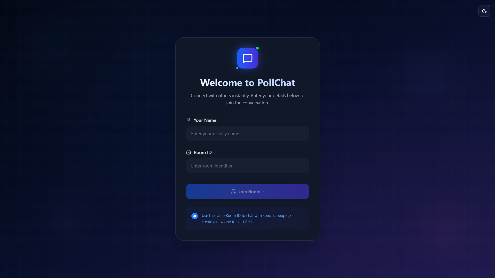
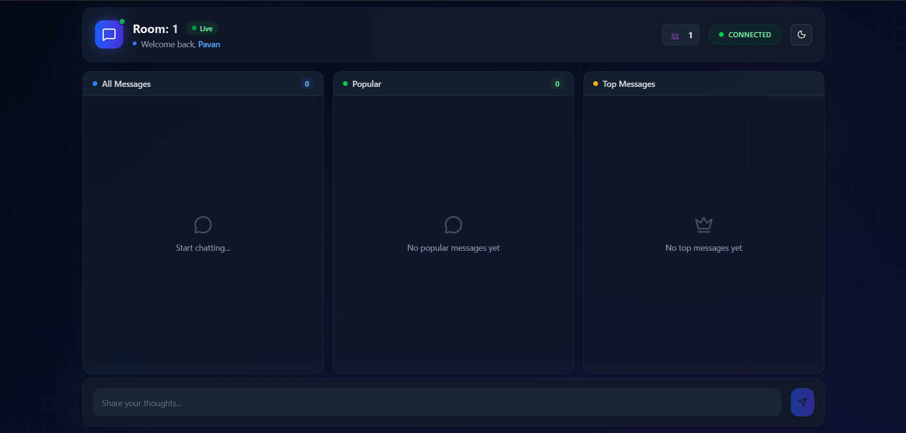
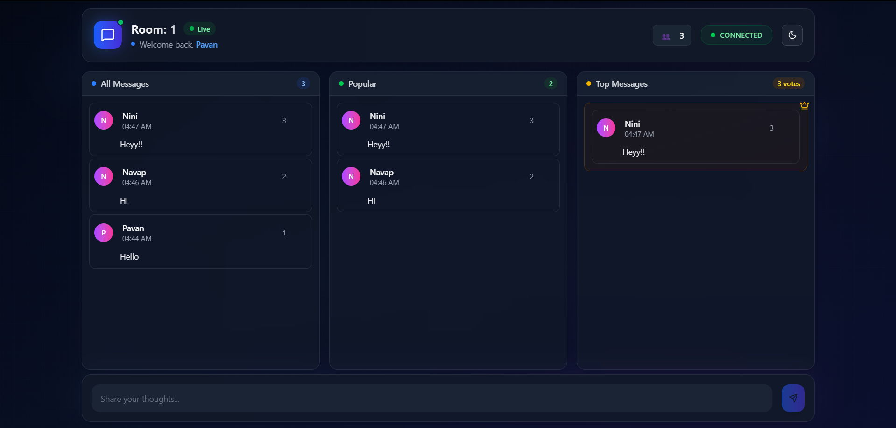

# PollChat: Real-Time Chat Application

PollChat is a real-time chat application that allows users to send messages, upvote them, and prioritize chats based on upvotes. The application is built with a **Node.js** and **TypeScript** backend using WebSockets, and a **React** frontend with **Tailwind CSS** for a sleek and modern user interface.


## 🚀 Features

### 🌟 Core Features
- **Real-Time Messaging**: Chat with others in real-time using WebSockets.
- **Upvote Messages**: Upvote messages to highlight important ones.
- **Priority Chats**: View messages with the highest upvotes in a dedicated section.
- **Room-Based Chats**: Join specific chat rooms using a unique Room ID.

### 🛠️ Backend Features
- **WebSocket Communication**: Real-time message broadcasting and upvote handling.
- **Room Management**: Tracks users and messages in specific rooms.
- **In-Memory Store**: Efficient message and user management during runtime.
- **Cleanup Logic**: Handles user disconnections and resource cleanup.


## 📂 Project Structure

```
root/
├── backend/               # Backend code
│   ├── src/               # Source files
│   ├── .env               # Environment variables
│   ├── package.json       # Backend dependencies and scripts
│   └── README.md          # Backend documentation
├── frontend/              # Frontend code
│   ├── src/               # Source files
│   ├── .env               # Environment variables
│   ├── package.json       # Frontend dependencies and scripts
│   └── README.md          # Frontend documentation
├── README.md              # Main repository documentation
└── LICENSE                # License file
```


## 🛠️ Installation

### Prerequisites
- **Node.js** (v16 or higher)
- **npm** (v7 or higher)

### Steps

1. **Clone the repository**:
   ```bash
   git clone https://github.com/bPavan16/pollchat.git
   cd pollchat
   ```

2. **Install dependencies**:
   - Backend:
     ```bash
     cd backend
     npm install
     ```
   - Frontend:
     ```bash
     cd ../frontend
     npm install
     ```

3. **Set up environment variables**:
   - Backend (.env):
     ```env
     PORT=8080
     NODE_ENV=development
     ```
   - Frontend (.env):
     ```env
     VITE_WEBSOCKET_URL=ws://localhost:8080
     ```

4. **Run the application**:
   - Start the backend:
     ```bash
     cd backend
     npm run dev
     ```
   - Start the frontend:
     ```bash
     cd ../frontend
     npm run dev
     ```

5. Open the application in your browser:
   ```
   http://localhost:5173
   ```


## 📦 Deployment

### Deploy to Vercel
1. Push the repository to GitHub.
2. Import the **frontend** directory into Vercel.
3. Add the environment variable:
   - `VITE_WEBSOCKET_URL`: The WebSocket URL of your backend.
4. Deploy the **backend** to a platform like Vercel, Railway, or Render.


## 🛠️ Technologies Used

### Frontend
- **React**: Component-based UI development.
- **shadcn/ui**: Modern UI components.
- **Tailwind CSS**: Utility-first CSS framework.
- **Vite**: Fast development server and build tool.

### Backend
- **Node.js**: JavaScript runtime for the backend.
- **TypeScript**: Type-safe development.
- **WebSocket**: Real-time communication.
- **dotenv**: Environment variable management.


## 📸 Demo
<div align="center">
### Lobby
<p align="center">
    
</p>
<p align="center"><em>A welcoming screen where users can join or create chat rooms.</em></p>


### Chatroom
<p align="center">
    
</p>
<p align="center"><em>The main chat interface showing real-time messages and upvotes.</em></p>


### Priority Messages
<p align="center">
    
</p>
<p align="center"><em>A view highlighting priority messages based on upvotes.</em></p>

</div>


## 🧩 Contributing

Contributions are welcome! Please follow these steps:
1. Fork the repository.
2. Create a new branch:
   ```bash
   git checkout -b feature/your-feature-name
   ```
3. Commit your changes:
   ```bash
   git commit -m "Add your message here"
   ```
4. Push to the branch:
   ```bash
   git push origin feature/your-feature-name
   ```
5. Open a pull request.


## 📜 License

This project is licensed under the MIT License.


## 📧 Contact

For questions or support, please contact:
- **GitHub**: [bPavan16](https://github.com/bPavan16)
---
<div align="center">

**Made with love by Pavan ❤️**  
Happy coding! 🚀

</div>
